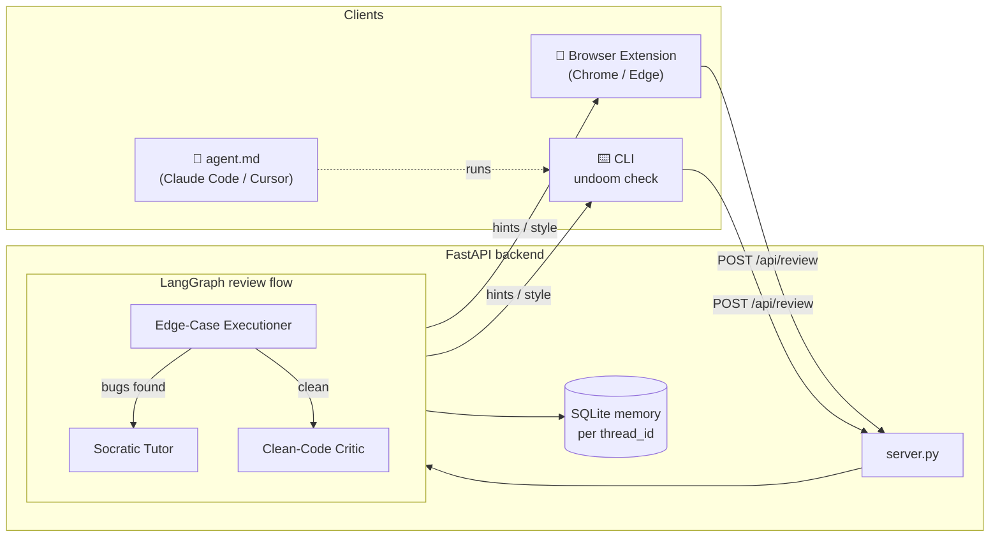

<div align="center">

# ⌁ Un-Doomed

### The Socratic AI code reviewer that makes you *think*.

[](#)
[](LICENSE)
[](#)
[](#)
[](#)

**Stop scrolling. Start building.**

</div>

---

## Why "Un-Doomed"?

Modern coding tools are happy to hand you the answer. That feels productive — until
you realise you've shipped code you don't understand and learned nothing. That's the
**doom**: stuck-and-frustrated on one side, copy-paste-and-clueless on the other.

**Un-Doomed refuses to write your fix.** Instead it reviews your code the way a great
mentor would, and guides you with **questions** until *you* find the bug. It's an
antidote to doomscrolling for developers: less passive consumption, more active
thinking.

It reviews in three strict stages:

| Stage | Reviewer | What it does |
|------:|----------|--------------|
| 1️⃣ | **Edge-Case Executioner** | Hunts correctness bugs first — empty inputs, duplicates, "no solution", off-by-ones. |
| 2️⃣ | **Socratic Tutor** | Turns each bug into a *question*. **Never** writes code (until you're genuinely stuck after several tries). |
| 3️⃣ | **Clean-Code Critic** | Only once the logic is sound: reviews Big-O complexity and style. |

---

## Architecture

One **FastAPI + LangGraph** backend (the "brain"), and clients that talk to it.



- **Backend** — `src/undoomed/` : the three reviewers (`socratic_reviewer.py`), the
  FastAPI API (`server.py`), and the CLI (`cli.py`). Memory persists per `thread_id`
  in SQLite, so your attempt counter survives restarts.
- **Bring your own key** — each client sends its own provider + API key per request;
  the server never needs to store one.
- **Pluggable models** — OpenAI, Anthropic (Claude), Google Gemini, or DeepSeek.

---

## Quick start (CLI)

```bash
# 1. Install the package (gives you the global `undoom` command + all deps)
pip install -e .

# 2. Start the backend (run from the repo root)
undoom serve

# 3. In another terminal, review a file
undoom check path/to/solution.py --task "Implement binary search"
```

On first `undoom check` you'll be prompted (once) for your **provider**, optional
**model**, and **API key** — saved to `~/.undoomed_config.json`. Want a different
backend (OpenAI/Claude/Gemini/DeepSeek)? Install its extra:

```bash
pip install -e ".[anthropic]"   # or .[gemini] / .[deepseek] / .[all]
```

> **Browser extension?** Load the repo folder as an unpacked extension via
> `chrome://extensions` → *Developer mode* → *Load unpacked*. Full steps in
> [documentation.md](documentation.md).

---

## Deploy the backend (Render / Railway)

The included [`Dockerfile`](Dockerfile) is production-ready — it installs all
providers and binds `uvicorn` to the platform's `$PORT`.

1. Push this repo to GitHub.
2. On **Render** or **Railway**, create a new service → **Deploy from repo** →
   choose **Docker**. No start command needed (the image's `CMD` handles it).
3. **Protect your compute** — set an environment variable
   `UNDOOMED_SERVER_SECRET=<a-long-random-string>`. The API then requires a matching
   `X-Server-Secret` header on every request (clients add it from their settings).
   Leave it unset for open local dev.
4. *(Optional, durable memory)* attach a disk and set
   `UNDOOMED_DB=/data/undoomed_state.db`.

Then point the clients at it:

- **Extension** → edit one line in [`config.js`](config.js)
  (`window.UNDOOMED_API_BASE_URL`).
- **CLI** → `export UNDOOMED_API_URL=https://your-backend.onrender.com`.

The landing page ([`website/`](website/)) is a Vite + React + Tailwind v4 app built
with **Bun** and deployed to **Vercel** (`vercel.json` builds it; `.vercelignore`
keeps the Python backend out of the deploy).

---

## Project layout

```
src/undoomed/      backend package (reviewers + FastAPI + CLI)
manifest.json …    browser extension (popup, options, content scripts)
config.js          single place to set the backend URL for the extension
agent.md           drop-in rules for Claude Code / Cursor
website/           marketing landing page (Vite + React + Tailwind v4, via Bun)
Dockerfile         backend container for Render/Railway
documentation.md   the full, plain-English deep dive
```

See **[documentation.md](documentation.md)** for an exhaustive, beginner-friendly
walkthrough of every file and decision.

---

## Contributing

Issues and PRs welcome. The philosophy is the product: **help people think, don't
think for them.**

## License

[MIT](LICENSE) © 2026 Animesh Gosain
